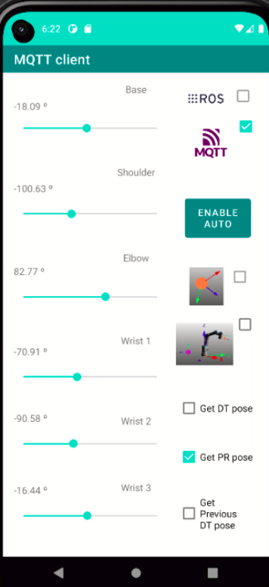

# adhoc-ROS-Mobile

This is an ad-hoc version of the Android application, named ROS-Mobile, for the robot operating system (Rottmann et al, 2020). The ad-hoc app is developed to integrate the capabilities of MQTT clients and ROS nodes on a smartphone.

## Purpose

The purpose of this app is to tele-operate robotics manipulators using two joysticks: one of them is used for XY plane movements while the other one is for controlling the Z axis motion. At the same time, the images from an IP camera can be displayed on the smartphone screen. In this case, we are interested in showing the images captured by the eye-in-hand.

In addition, a new ROS subscriber serves as a traffic light (green, yellow and red) to indicate the pressure exerted on the end-effector, where there is an ultrasound camera to perform a medical scanning. 

On the other hand, another space on the screen can show the virtual environment associated with the digital twin of the robot. This visualization is associated with a screen stream from a LAN/WAN socket (IP + port). This same layout can display the images coming from the ultrasound camera attached on the robot tip. The user can switch between both visualizations using two buttons (US for ultrasound scanning and DT for digital twin visualization).

Finally, another ROS subscriber can be integrated, using the camera plugin, for displaying the images coming from the assitant's camera. The images of this  camera are published via ROS from another smartphone using the UMA-ROS-Android app.

## New characteristics: 

1) Visualization for IP cameras and screen stream
2) A ROS node subscriber that establish a color on the screen depending on the values published on the topic
3) The integration of a new tab to access to some MQTT clients.
4) A new frontend for the activity where the widgets are shown (VizFragment).

All in all, with respect to the ROS-Mobile app:

- A new ROS subscriber is included to show with colors (green, yellow or red) the intensity of the forces coming on a specific topic where the forces read by the sensor-in-hand are published. Thus, a new widget can be found: "buttonsubscriber".

- In addition, the class VizFragment.java and its layout associted (fragment_viz.xml) have been modified. 

- The ssh tab has been replaced by the MQTT tab in order to connect with MQTT clients tha manages the DT of this research project.

## Results

The IoCA architecture for robotic manipulators and the result of using this app within it have been the subject of a research paper submitted to the IEEE Robotics and Automation Letters. If the paper is accepted, more explanation will be shown here.

## Activity for controlling the robotic manipulator

    

    

    

## How to use

## References

Rottmann, N., Studt, N., Ernst, F., & Rueckert, E. (2020). Ros-mobile: An android application for the robot operating system. arXiv preprint arXiv:2011.02781.
